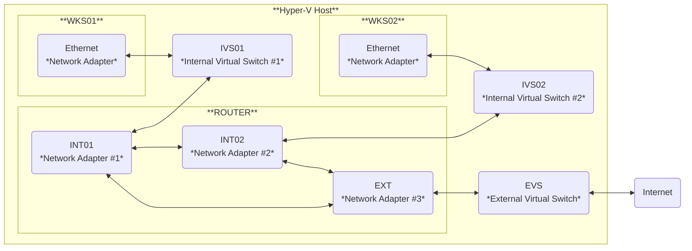

# Setting Up Windows Server as a Router

To simulate communication between two data centers on Hyper-V, set up a Windows Server to route traffic between two internal virtual networks. Additionally, enable NAT to allow internal networks to connect to the internet through external virtual network.



## Prerequisites

1. Create an external virtual switch `EVS` on the Hyper-V host.
2. Create two internal virtual switches `IVS01` and `IVS02` on the Hyper-V host.
3. Create a Windows Server virtual machine `ROUTER` to act as the router.
4. Create two Windows virtual machines `WKS01` and `WKS02` as clients for the two data centers.

## Configure Network Adapters

1. Attach virtual switches `EVS`, `IVS01`, and `IVS02` to the virtual machine `ROUTER`.
2. Rename network adapters to `EXT`, `INT01`, and `INT02` accordingly.
3. Set static IP address, default gateway, and DNS server on `EXT` for internet access.
4. Set static IP addresses on `INT01` and `INT02`, default gateway and DNS server are not required.

## Enable Routing and NAT

1. Install Windows feature on the virtual machine `ROUTER`:
    ```powershell
    Install-WindowsFeature -Name 'Routing' -IncludeManagementTools
    ```
2. Open **Routing and Remote Access**.
3. Right-click the server `ROUTER (local)` and select **Configure and Enable Routing and Remote Access**.
4. Follow the wizard to enable routing and NAT:
    - Select **Network address translation (NAT)**.
    - Select `EXT` as the public interface to connect to the internet.
    - Select `INT01` as the interface for the network that will have access to the internet.
    - Select **I will set up name and address services later**.
5. Navigate to the server `ROUTER (local)` > **IPv4** > **NAT**, right-click and select **New Interface**.
6. Select `INT02` as the private interface connected to private network.

## Verification

1. Attach virtual switch `IVS01` to virtual machine `WKS01` and configure the network adapter.
2. Attach virtual switch `IVS02` to virtual machine `WKS02` and configure the network adapter.
3. Test connectivity between two virtual machines and verify internet access.
